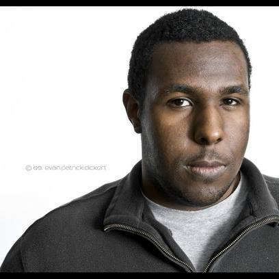

<h1 class="page-heading">About</h1>

	<ul class="about-bullets">
	<li>Nashville Native</li>
	<li>Cigar Aficionado</li>
	<li>Automotive Enthusiast</li>
	</ul>
	

	

	

	
subscribe <a href="{{ "/feed.xml" | prepend: site.baseurl }}">via RSS</a>

	

